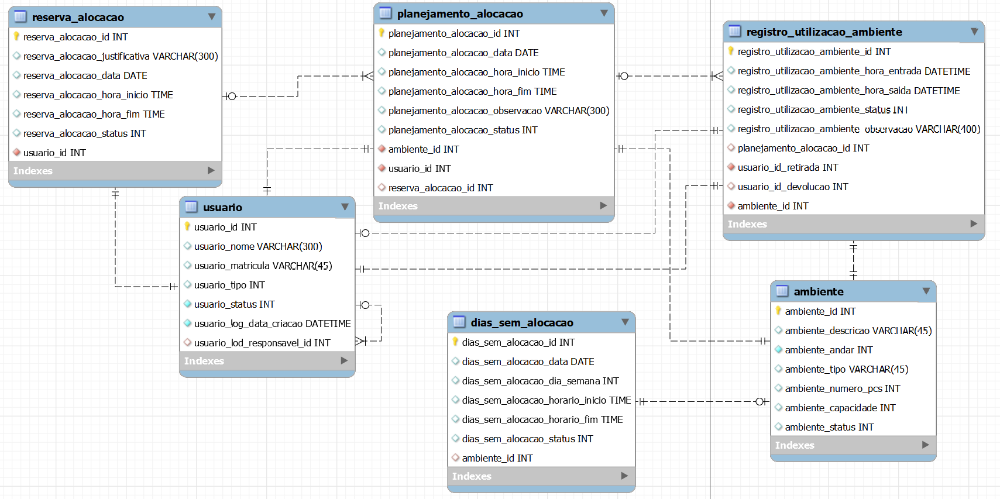

# Reservation CRUD - Back-end Java SpringBoot

Welcome to the repository for the Reservation CRUD project for the Senac RJ college. This project is a Back-end system developed using Java with the SpringBoot framework.

## Table of Contents

1. [Overview](#overview) 📝
2. [Project Features](#project-features) ⭐
3. [Database Model](#database-model) 💾
4. [Project Structure](#project-structure) 🏗️
5. [Endpoints](#endpoints) 📜
6. [How to Run the Project](#how-to-run-the-project) 🚀
7. [Contributing](#contributing) 🤝

---

## Overview 📝

This project aims to create a Back-end application for managing and allocating rooms at Senac RJ college. The application uses SpringBoot and provides functionality for performing CRUD operations on tables in a MySQL database.

## Project Features ⭐

- **Swagger Library Configured**: Automatic documentation of API endpoints.
- **Database Connection**: Configuration to connect to a MySQL database.
- **CRUD Endpoints**: Full CRUD operations (List, List by ID, Create, Update and Soft Delete).
- **Package Structure**: `com.senac.daniela.gerenciamentosalas`.
- **Database Model**: Configured according to the provided specifications.

## Database Model 💾



### Connection

- **Host**: edumysql.acesso.rj.senac.br
- **Port**: 3306
- **Database**: bdchaves
- **User**: chave
- **Password**: adsads

## Project Structure

- **controllers**: Contains REST controllers that handle HTTP requests.
- **entities**: Contains JPA entities representing the database tables.
- **repository**: Contains repository interfaces for database operations.
- **services**: Contains service classes that handle business logic.
- **Exceptions**: The main application class that starts the Spring Boot application.
- **config**: Contains configuration classes, such as Swagger configuration.

## Endpoints

**Swagger**: localhost:8080/senac

### Usuário:

| Método | Endpoint                           | Descrição                                          |
|--------|------------------------------------|----------------------------------------------------|
| GET    | /usuario                           | Lista todas os usuario                             |
| GET    | /usuario/buscar/{id}                      | Lista um usuario por ID                            |
| POST   | /usuario/adiciona                  | Cria um novo usuario                               |
| PUT    | /usuario/atualizar/{id}               | Atualiza um usuario existente                      |
| DELETE | /usuario/deletar/{id}               | Remove um usuario (apagado lógico)                 |

### Registro:

| Método | Endpoint                           | Descrição                                          |
|--------|------------------------------------|----------------------------------------------------|
| GET    | /registro                          | Lista todas os registros                           |
| GET    | /registro/buscar/{id}                     | Lista um registro por ID                           |
| POST   | /registro/adicionar                 | Cria um novo registro                              |
| PUT    | /registro/atualizar/{id}              | Atualiza um registro existente                     |
| DELETE | /registro/deletar/{id}              | Remove um registro (apagado lógico)                |

### Planejamento Alocação:

| Método | Endpoint                   | Descrição                                          |
|--------|----------------------------|----------------------------------------------------|
| GET    | /planejamento              | Lista todas os planejamento alocacao               |
| GET    | /planejamento/buscar/{id}         | Lista um planejamento alocacao por ID              |
| POST   | /planejamento/adicionar     | Cria um novo planejamento alocacao                 |
| PUT    | /planejamento/atualizar/{id}  | Atualiza um planejamento alocacao existente        |
| DELETE | /planejamento/deletar/{id}  | Remove um planejamento alocacao (apagado lógico)   |

### Dias sem alocação:

| Método | Endpoint                      | Descrição                                      |
|--------|-------------------------------|------------------------------------------------|
| GET    | /dias-sem-alocacao              | Lista todas os dias sem alocacao               |
| GET    | /dias-sem-alocacao/buscar/{id}         | Lista um dia sem alocacao por ID               |
| POST   | /dias-sem-alocacao/adicionar     | Cria um novo dias sem alocacao                 |
| PUT    | /dias-sem-alocacao/atualizar/{id}  | Atualiza um dias sem alocacao existente        |
| DELETE | /dias-sem-alocacao/deletar/{id}  | Remove um dias sem alocacao (apagado lógico)   |

### Ambiente:

| Método | Endpoint               | Descrição                           |
|--------|------------------------|-------------------------------------|
| GET    | /ambiente              | Lista todos os ambientes            |
| GET    | /ambiente/buscar/{id}         | Lista um ambiente por ID            |
| POST   | /ambiente/adicionar    | Cria um novo ambiente               |
| PUT    | /ambiente/atualizar/{id}  | Atualiza um ambiente existente      |
| DELETE | /ambiente/deletar/{id}  | Remove um ambiente (apagado lógico) |

### Reserva:

| Método | Endpoint                    | Descrição                           |
|--------|-----------------------------|-------------------------------------|
| GET    | /senac/reserva              | Lista todas as reservas             |
| GET    | /senac/reserva/buscar/{id}         | Lista uma reserva por ID            |
| POST   | /senac/reserva/adicionar     | Cria uma nova reserva               |
| PUT    | /senac/reserva/atualizar/{id}  | Atualiza uma reserva existente      |
| DELETE | /senac/reserva/deletar/{id}  | Remove uma reserva (apagado lógico) |


## How to Run the Project 🚀

1. **Clone the Repository**

   ```bash
   git clone https://github.com/danielasegadilha/spring-reservation-crud.git

2. **Navigate to the Project Directory**

   ```bash
   cd spring-reservation-crud

3. **Compile and Run the Project**

   ```bash
   mvn spring-boot:run

## Contributing 🤝

If you would like to contribute to this project, please follow these steps:

1. **Fork the repository**
2. **Create a branch for your feature** (`git checkout -b feature/new-feature`)
3. **Commit your changes** (`git commit -am 'Add new feature'`)
4. **Push to the branch** (`git push origin feature/new-feature`)
5. **Open a Pull Request**

We appreciate your contributions and will review your pull request as soon as possible!
